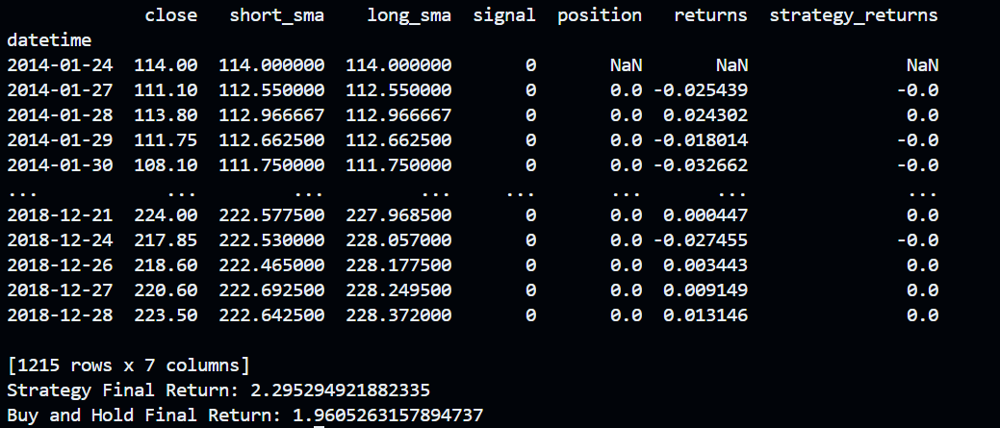
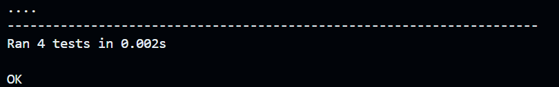

# Invsto Assignment

## Inserting Data into the PostgreSQL Database

```insert_data.py``` script inserts data into the PostgreSQL database. It reads the data from the ```HINDALCO.csv``` file and inserts it into the 'stock_data' table in the database.

## Simple Moving Average Calculation

```simple_moving_average.py``` calculates the Simple Moving Average (SMA) of the 'close' column of the 'stock_data' table in the PostgreSQL database. It calculates SMA for 20 days and 100 days and implements a SMA crossover strategy.

## Unit test

```test_data_validataion.py``` implements unit tests to check if the data inserted into the database is of the correct data types.

## Results of the SMA Crossover Strategy

The SMA crossover strategy was implemented using a 20-day short-term SMA and a 100-day long-term SMA. The strategy generates buy signals when the short-term SMA crosses above the long-term SMA and sell signals when the short-term SMA crosses below the long-term SMA.

**Performance Comparison:**

The performance of the SMA crossover strategy was compared against a simple buy-and-hold strategy over the period from 2014-01-24 to 2018-12-28. 



**Final Returns:**

* **Strategy Final Return:** 2.2952 
* **Buy and Hold Final Return:** 1.9605

**Interpretation:**

The results indicate that the SMA crossover strategy with a 20-day short window and 100-day long window significantly outperformed the buy-and-hold approach for Hindalco stock during this specific period. The strategy achieved a cumulative return of approximately 129.52%, while the buy-and-hold strategy yielded a return of approximately 96.05%.

## Result of the unit tests

